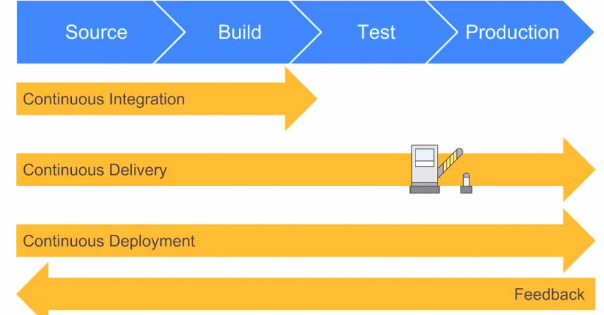
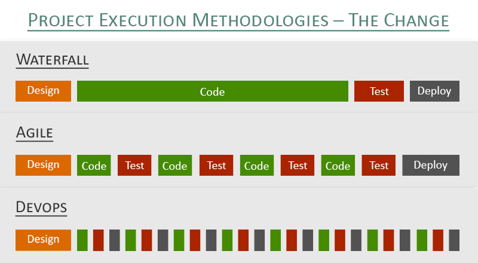

# Ci start code 
SLDC - Software development lifecycle - is a framework to define tasks performed at each step in the software development process

## What is a pipeline?
- A pipeline consists of a chain of processing elements arranged so that the output of each element is the input of the next. 
- A set of automated processes that allow Developers and DevOps professionals to reliably and efficiently compile, build and deploy their code to their production compute platforms.
 

# CICD
## What's difference Continuous Delivery and Continuous Integration
- CI/CD pipeline automates software delivery process 
- The pipeline builds code, run tests (CI), then safely deploys a new version of the application (CD)
- Automated pipeline helps:
    - reduce the need for manual error checks
    - faster integration of new team members, and more productivity because the need to learn complex development and test environment is removed
    - A development team or QA can detect code during feedback loop and reject it 
    - provide visibility and breakdown of code during each successive stage


## CI/CD/CD
- ```Continuous Integration``` is a software development practice where developers merge code to a central repository (GitHub)
various times  a day. Implementation of CI avoids merges branches into release branch 


- ```Continuous Delivery``` is considered the extension of continuous integration to ensure changes are updated in a sustainable process
- Not only the testing is automated but wiht CD, release process is also automated so deployment can be initiated anytime. 
__In CDelivery the deployment is completed manually__ . 
    - Sends it constant state to be ready for deployment 
	- Ci delivery is after integration and done manually (Node app.js manually) and operates before the release to the client
	
- ```Continuous Deployment``` is considered the extra step beyond continuous delivery, with this practice, every change that passes the 
production pipeline is released customers, __No human intervention is require__ .  
    - is done automated with reverse proxy using just node app.js - only when all tests pass - After release to client 
   
 __All these processes are fully automated, with each run fully logged and visible to the entire team__


    


## What is CI CD pipeline?
CI/CD pipeline refers to automation of numerous processes:
- imitating code builds
- automating testing 
- automating deployment


CI/CD has enabled a devops culture