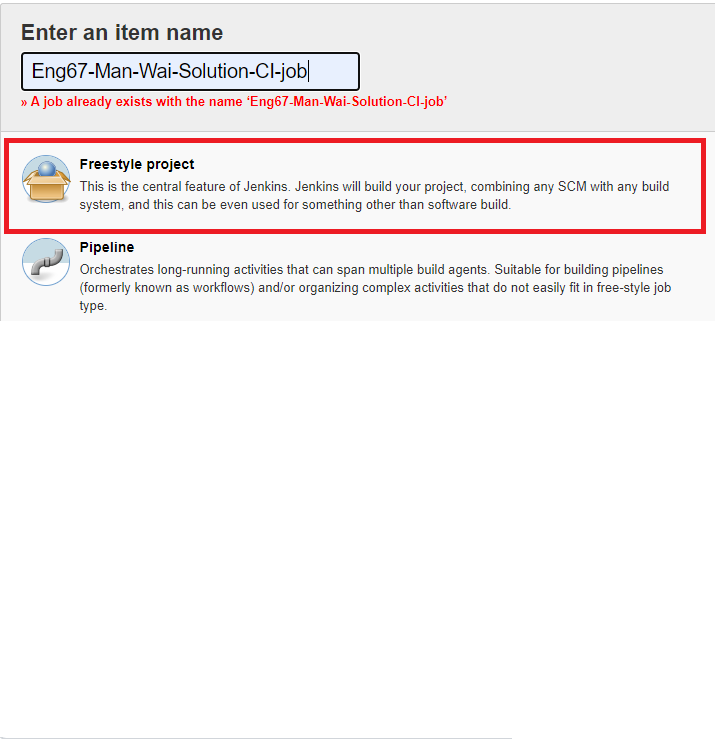

# NodeJs Sample Webapp Engineering 67 :taco:

# Creating CI/CD Pipeline


### First create a Webook for a repository. Go into the Repo settings > Webhooks > add Webhook

### Then add the payload URL, use the webapp URL:
```http://18.132.46.105:8080/github-webhook/```


## Continues Integration 

### 1) First click on the ```new item``` as seen below 


### 2) Enter the name of the project and select the Freestyle project type


### 3) Enter the configurations 

### 4) Next, test the build by clicking build now. The build will appear in build history. The build is started when you 
```git push``` to Github 


### 5) If the build is successful, there should be 3 passes! Any errors can be found in the console output


### Continuos Deployment (CD) 
#### Similarly to the CI job, CD is created, create an appropriate name such as ```name deploy job```

#### The major difference between this and the CI is the execute command shell, please insert the following: 


#### Again, build on the __CI JOB__ this will automatically pass the build to this CD job if succesful


)